The examples below are written in Julia, there are many more [in Python](http://scikit-learn.org/stable/auto_examples/index.html). Most examples use Python models, those that use Julia models are marked as such. 

Example | Description
---|---
 <a href="../examples/Classifier_Comparison.ipynb">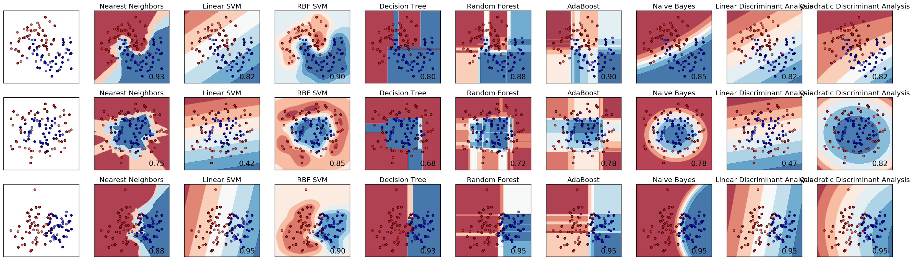 </a>  | **Classifier Comparison**: A comparison of a several classifiers in scikit-learn on synthetic datasets. The point of this example is to illustrate the nature of decision boundaries of different classifiers. This should be taken with a grain of salt, as the intuition conveyed by these examples does not necessarily carry over to real datasets.  Particularly in high-dimensional spaces, data can more easily be separated linearly and the simplicity of classifiers such as naive Bayes and linear SVMs might lead to better generalization than is achieved by other classifiers.  The plots show training points in solid colors and testing points semi-transparent. The lower right shows the classification accuracy on the test set.
 <a href="../examples/Classifier_Comparison_Julia.ipynb">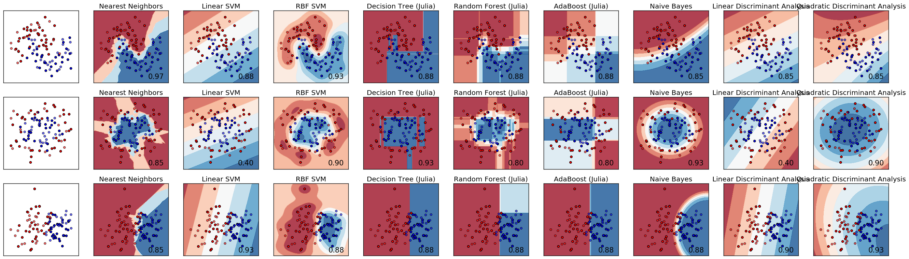 </a>  | **Classifier Comparison (Julia classifiers)**: A comparison of a several classifiers in scikit-learn on synthetic datasets. The point of this example is to illustrate the nature of decision boundaries of different classifiers. This should be taken with a grain of salt, as the intuition conveyed by these examples does not necessarily carry over to real datasets.  Particularly in high-dimensional spaces, data can more easily be separated linearly and the simplicity of classifiers such as naive Bayes and linear SVMs might lead to better generalization than is achieved by other classifiers.  The plots show training points in solid colors and testing points semi-transparent. The lower right shows the classification accuracy on the test set.
   | **Comparing different clustering algorithms on toy datasets**: This example aims at showing characteristics of different clustering algorithms on datasets that are interesting but still in 2D. The last dataset is an example of a null situation for clustering: the data is homogeneous, and there is no good clustering.  While these examples give some intuition about the algorithms, this intuition might not apply to very high dimensional data.  The results could be improved by tweaking the parameters for each clustering strategy, for instance setting the number of clusters for the methods that needs this parameter specified. Note that affinity propagation has a tendency to create many clusters. Thus in this example its two parameters (damping and per-point preference) were set to to mitigate this behavior.
 <a href="../examples/Cross_Validated_Predictions.ipynb">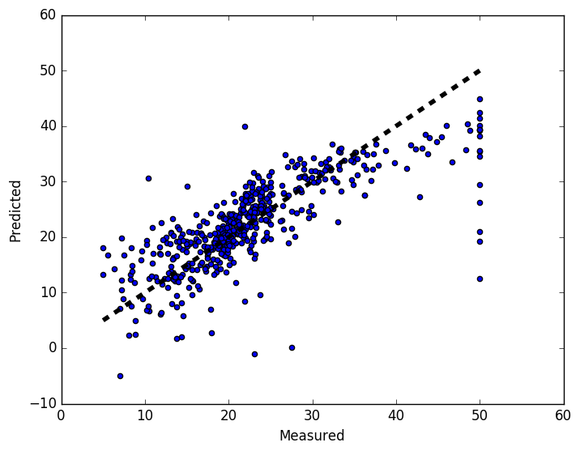 </a>  | **Plotting Cross-Validated Predictions**: This example shows how to use cross_val_predict to visualize prediction errors.
 <a href="../examples/Decision_Tree_Regression.ipynb">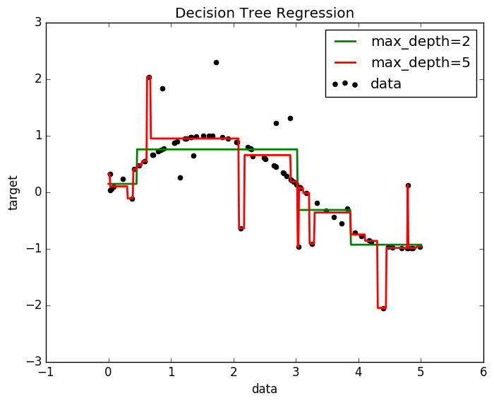 </a>  | **Decision Tree Regression**: using ScikitLearn  # Import the necessary modules and libraries @sk_import tree: DecisionTreeRegressor using PyPlot  # Create a random dataset srand(42) X = sort(5 * rand(80)) XX = reshape(X, 80, 1) y = sin(X) y[1:5:end] += 3 * (0.5 - rand(16))  # Fit regression model regr_1 = DecisionTreeRegressor(max_depth=2) regr_2 = DecisionTreeRegressor(max_depth=5) fit!(regr_1, XX, y) fit!(regr_2, XX, y)  # Predict X_test = 0:0.01:5.0 y_1 = predict(regr_1, X_test'') y_2 = predict(regr_2, X_test'')  # Plot the results scatter(X, y, c="k", label="data") plot(X_test, y_1, c="g", label="max_depth=2", linewidth=2) plot(X_test, y_2, c="r", label="max_depth=5", linewidth=2) xlabel("data") ylabel("target") title("Decision Tree Regression") legend() show()
 <a href="../examples/Decision_Tree_Regression_Julia.ipynb">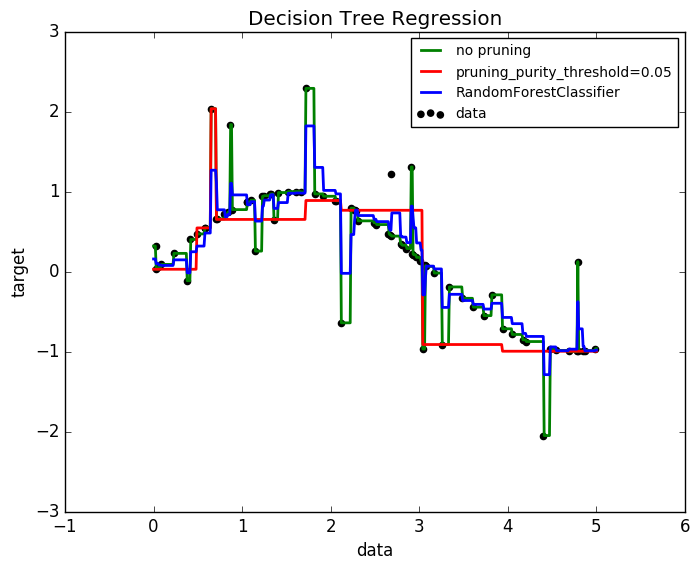 </a>  | **Decision Tree Regression (using DecisionTrees.jl)**: A 1D regression with decision tree.  The decision trees is used to fit a sine curve with addition noisy observation. As a result, it learns local linear regressions approximating the sine curve.  We can see that if the maximum depth of the tree (controlled by the max_depth parameter) is set too high, the decision trees learn too fine details of the training data and learn from the noise, i.e. they overfit.
 <a href="../examples/Density_Estimation.ipynb">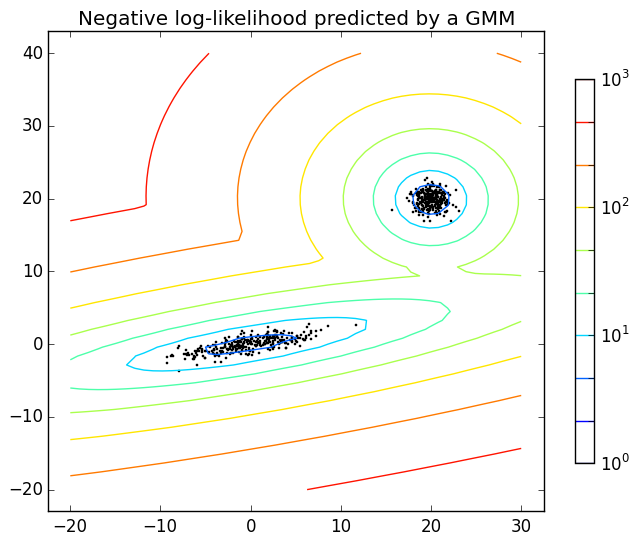 </a>  | **Density Estimation for a mixture of Gaussians**: Plot the density estimation of a mixture of two Gaussians. Data is generated from two Gaussians with different centers and covariance matrices.
 <a href="../examples/Density_Estimation_Julia.ipynb">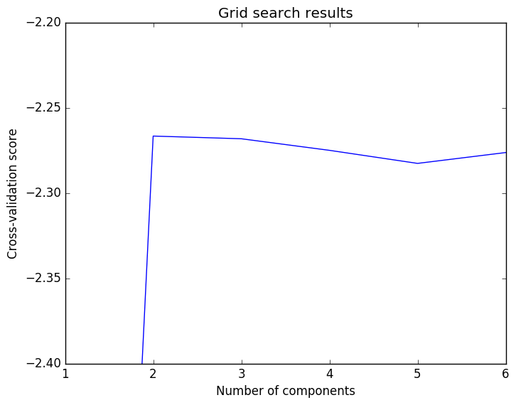 </a>  | **Density Estimation for a mixture of Gaussians (using GaussianMixtures.jl)**: Plot the density estimation of a mixture of two Gaussians, then use cross-validation to find the optimal number of clusters. Data is generated from two Gaussians with different centers and covariance matrices. We then use `GridSearchCV` to find the optimal number of mixtures.
 <a href="../examples/Feature_Stacker.ipynb">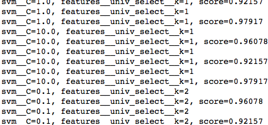 </a>  | **Concatenating multiple feature extraction methods**: In many real-world examples, there are many ways to extract features from a dataset. Often it is beneficial to combine several methods to obtain good performance. This example shows how to use FeatureUnion to combine features obtained by PCA and univariate selection.  Combining features using this transformer has the benefit that it allows cross validation and grid searches over the whole process.  The combination used in this example is not particularly helpful on this dataset and is only used to illustrate the usage of FeatureUnion.
 <a href="../examples/Gaussian_Processes_Julia.ipynb">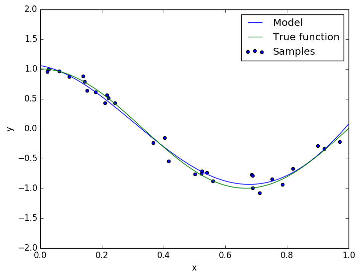 </a>  | **Gaussian Processes (Julia)**: using ScikitLearn using ScikitLearn.GridSearch using PyPlot using GaussianProcesses: GP, MeanZero, SE  srand(42) # Training data n = 10 x = 2 * rand(n, 1) y = sin(x[:, 1]) + 0.05*randn(n)
 <a href="../examples/Outlier_Detection.ipynb">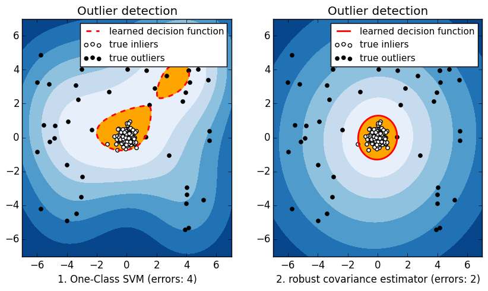 </a>  | **Outlier detection with several methods**: When the amount of contamination is known, this example illustrates two different ways of performing Novelty and Outlier Detection:  * based on a robust estimator of covariance, which is assuming that the data are Gaussian distributed and performs better than the One-Class SVM in that case. * using the One-Class SVM and its ability to capture the shape of the data set, hence performing better when the data is strongly non-Gaussian, i.e. with two well-separated clusters;  The ground truth about inliers and outliers is given by the points colors while the orange-filled area indicates which points are reported as inliers by each method.  Here, we assume that we know the fraction of outliers in the datasets. Thus rather than using the predict method of the objects, we set the threshold on the decision_function to separate out the corresponding fraction.
 <a href="../examples/Pipeline_PCA_Logistic.ipynb">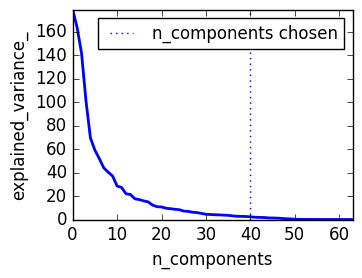 </a>  | **Pipelining: chaining a PCA and a logistic regression**: The PCA does an unsupervised dimensionality reduction, while the logistic regression does the prediction.  We use a GridSearchCV to set the dimensionality of the PCA
 <a href="../examples/Plot_Kmeans_Digits.ipynb">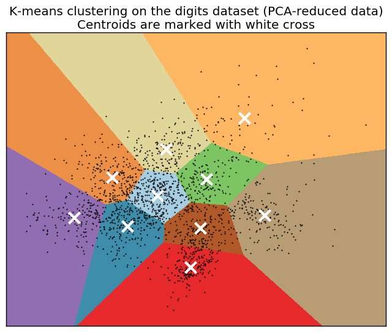 </a>  | **A demo of K-Means clustering on the handwritten digits data**: In this example we compare the various initialization strategies for K-means in terms of runtime and quality of the results.  As the ground truth is known here, we also apply different cluster quality metrics to judge the goodness of fit of the cluster labels to the ground truth.
 <a href="../examples/Plot_Kmeans_Digits_Julia.ipynb">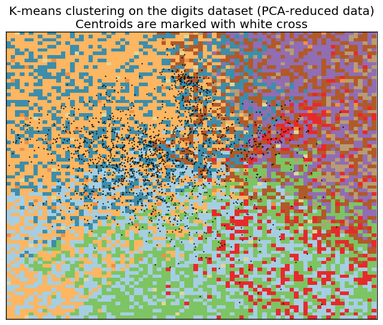 </a>  | **A demo of K-Means clustering on the handwritten digits data (using LowRankModels.jl)**: In this example we apply K-Means to the digits dataset.  As the ground truth is known here, we also apply different cluster quality metrics to judge the goodness of fit of the cluster labels to the ground truth.  **IMPORTANT NOTE**: LowRankModels.jl's PCA is correct (though slower than conventional algorithms), but its K-Means does not always converge, as can be seen in the last figure. It's an ongoing effort.
   | **Comparing randomized search and grid search for hyperparameter estimation**: Compare randomized search and grid search for optimizing hyperparameters of a random forest. All parameters that influence the learning are searched simultaneously (except for the number of estimators, which poses a time / quality tradeoff).  The randomized search and the grid search explore exactly the same space of parameters. The result in parameter settings is quite similar, while the run time for randomized search is drastically lower.  The performance is slightly worse for the randomized search, though this is most likely a noise effect and would not carry over to a held-out test set.  Note that in practice, one would not search over this many different parameters simultaneously using grid search, but pick only the ones deemed most important.
 <a href="../examples/RBM.ipynb">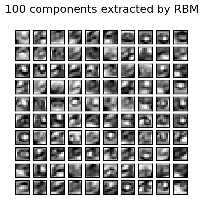 </a>  | **Restricted Boltzmann Machine features for digit classification**: For greyscale image data where pixel values can be interpreted as degrees of blackness on a white background, like handwritten digit recognition, the Bernoulli Restricted Boltzmann machine model (BernoulliRBM) can perform effective non-linear feature extraction.  In order to learn good latent representations from a small dataset, we artificially generate more labeled data by perturbing the training data with linear shifts of 1 pixel in each direction.  This example shows how to build a classification pipeline with a BernoulliRBM feature extractor and a LogisticRegression classifier. The hyperparameters of the entire model (learning rate, hidden layer size, regularization) were optimized by grid search, but the search is not reproduced here because of runtime constraints.  Logistic regression on raw pixel values is presented for comparison. The example shows that the features extracted by the BernoulliRBM help improve the classification accuracy.
 <a href="../examples/Simple_1D_Kernel_Density.ipynb">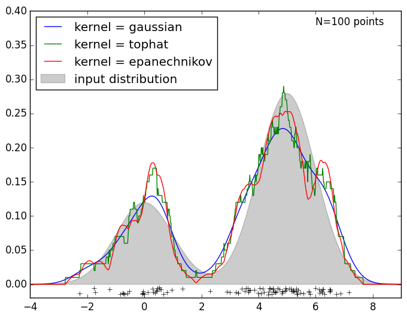 </a>  | **Simple 1D Kernel Density Estimation**: The PCA does an unsupervised dimensionality reduction, while the logistic regression does the prediction.  We use a GridSearchCV to set the dimensionality of the PCA
   | **Sample pipeline for text feature extraction and evaluation**: The dataset used in this example is the 20 newsgroups dataset which will be automatically downloaded and then cached and reused for the document classification example.  You can adjust the number of categories by giving their names to the dataset loader or setting them to None to get the 20 of them.
 <a href="../examples/Two_Class_Adaboost.ipynb">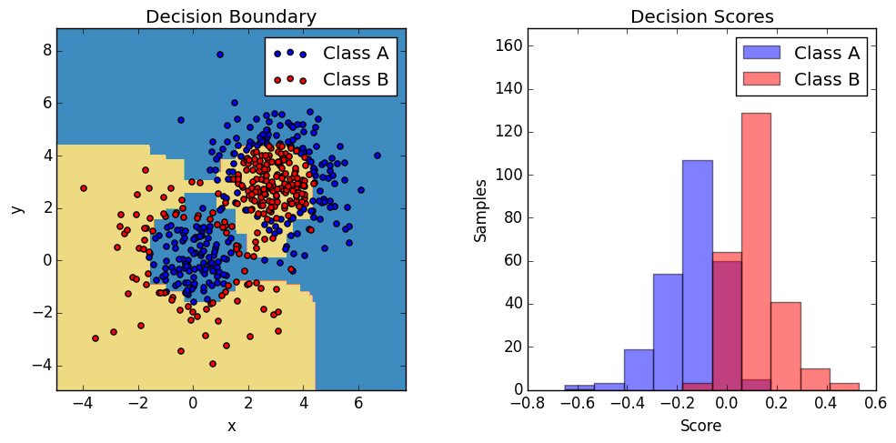 </a>  | **Two Class Adaboost**: This example fits an AdaBoosted decision stump on a non-linearly separable classification dataset composed of two Gaussian quantiles clusters (see `sklearn.datasets.make_gaussian_quantiles`) and plots the decision boundary and decision scores. The distributions of decision scores are shown separately for samples of class A and B. The predicted class label for each sample is determined by the sign of the decision score. Samples with decision scores greater than zero are classified as B, and are otherwise classified as A. The magnitude of a decision score determines the degree of likeness with the predicted class label. Additionally, a new dataset could be constructed containing a desired purity of class B, for example, by only selecting samples with a decision score above some value.
 <a href="../examples/Underfitting_vs_Overfitting.ipynb">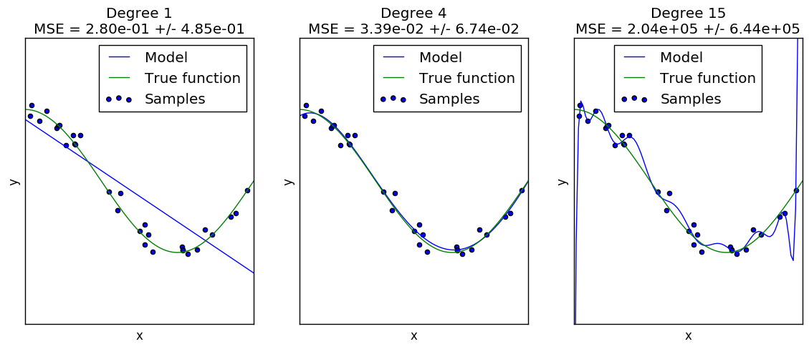 </a>  | **Underfitting vs. Overfitting**: This example demonstrates the problems of underfitting and overfitting and how we can use linear regression with polynomial features to approximate nonlinear functions. The plot shows the function that we want to approximate, which is a part of the cosine function. In addition, the samples from the real function and the approximations of different models are displayed. The models have polynomial features of different degrees. We can see that a linear function (polynomial with degree 1) is not sufficient to fit the training samples. This is called underfitting. A polynomial of degree 4 approximates the true function almost perfectly. However, for higher degrees the model will overfit the training data, i.e. it learns the noise of the training data. We evaluate quantitatively overfitting / underfitting by using cross-validation. We calculate the mean squared error (MSE) on the validation set, the higher, the less likely the model generalizes correctly from the training data.
